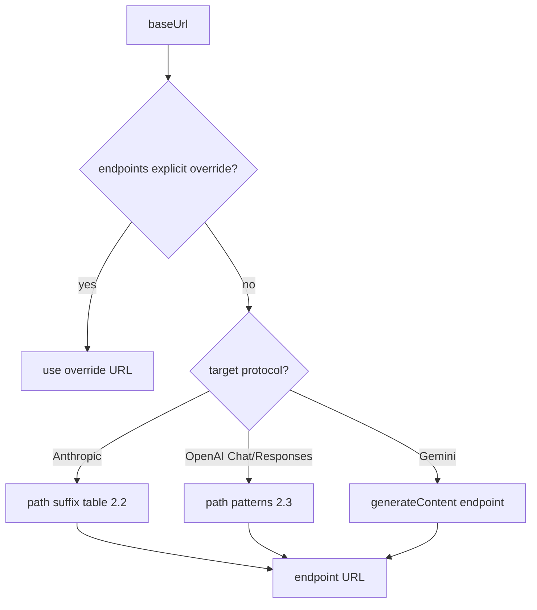

# Provider protocol survey

> Starting from cc-switch's built-in vendor list (85 vendors), distilled from
> vendors' primary sources (direct API probing + official docs) into a **unified
> protocol model** — "vendor diversity → common rules", not an endpoint registry.
> **Purpose**: the endpoint-derivation evidence source — what awitch can derive
> from a base URL alone vs. what must be per-vendor data (provider templates,
> ADR-0013 migration, the adapter's `KNOWN_COMPAT_SUFFIXES` lookup).
> **Coverage**: 85 vendors — 19 individually probed, 33 gateway-class inferred
> by the multiplexing convention (probe before onboarding), the rest unprobed
> (appendix). Per-vendor data in `provider-protocol-survey-data.md`.

## Using this survey

To onboard a vendor: §2 gives what's derivable from its base URL; the vendor's
data entry in `provider-protocol-survey-data.md` records its known facts; what's
marked `‡`/`†` or inferred (the 33 gateways) — probe before trusting. §1 says
which access modes exist; §4 says which operational endpoints (model list /
balance) are common.

## 1. Protocol families

Vendor access modes fall into five families, of which awitch serves **three** —
anthropic / openai chat / openai responses (CONTEXT.md).
**Gemini** and **bedrock** are documented as the remaining vendor access modes; awitch does
not serve them natively (no protocol variant, no template) — their data is
survey context, not template material.

| Family               | Standard endpoint                               | Auth                              | Client ecosystem                                                                                                                  |
| -------------------- | ----------------------------------------------- | --------------------------------- | --------------------------------------------------------------------------------------------------------------------------------- |
| **anthropic**        | `POST {base}/v1/messages`                       | `x-api-key` + `anthropic-version` | Claude Code / Claude Desktop                                                                                                      |
| **openai chat**      | `POST {base}/v1/chat/completions`               | `Authorization: Bearer`           | aggregators by default, `@ai-sdk/openai-compatible`, Hermes `chat_completions`                                                    |
| **openai responses** | `POST {base}/v1/responses`                      | `Authorization: Bearer`           | Codex native protocol, `@ai-sdk/openai`                                                                                           |
| **gemini**           | `POST {base}/v1beta/models/{m}:generateContent` | `x-goog-api-key`                  | Gemini CLI official (GATEWAY mode points `GOOGLE_GEMINI_BASE_URL` at third-party gateways, still this protocol); third-party rare |
| **bedrock**          | `POST {base}/model/{id}:converse`               | SigV4                             | OpenClaw `bedrock-converse-stream`, `@ai-sdk/amazon-bedrock`                                                                      |

## 2. Generic endpoint-derivation rules

### 2.1 Standard endpoint shapes per protocol

Given a vendor base URL `{base}`, each protocol's endpoint follows this priority:

1. Vendor explicit declaration (per-protocol URL override) — beats every convention
2. Anthropic-compat: check the **path-suffix table** (2.2)
3. OpenAI family: check the **path patterns** (2.3)
4. Version-segment handling (2.4)
5. Port fixed at 443 (2.4)

### 2.2 Anthropic-compatible path-suffix table

Anthropic Messages is the de-facto standard for third-party Claude Code access,
but its URL shape varies by vendor and **cannot be derived from the protocol
name**. The generic mechanism = a suffix-mapping table:

| Pattern                            | Endpoint shape                      | Vendors (probed)                                                 |
| ---------------------------------- | ----------------------------------- | ---------------------------------------------------------------- |
| bare-domain root                   | `{base}/v1/messages`                | 41 gateway-class vendors + ModelScope, SiliconFlow               |
| `/api`                             | `{base}/api/v1/messages`            | OpenRouter                                                       |
| `/anthropic`                       | `{base}/anthropic/v1/messages`      | DeepSeek, Moonshot, MiniMax, Novita, Xiaomi MiMo, Longcat, Baidu |
| `/api/anthropic`                   | `{base}/api/anthropic/v1/messages`  | Zhipu (cn/en)                                                    |
| `/apps/anthropic`                  | `{base}/apps/anthropic/v1/messages` | Alibaba DashScope                                                |
| `/anthropic/coding`                | `{base}/anthropic/coding`           | Baidu Coding Plan                                                |
| `/api/coding`                      | `{base}/api/coding`                 | Volcano Agentplan / BytePlus                                     |
| `/api/compatible`                  | `{base}/api/compatible`             | Volcano DouBaoSeed                                               |
| `/step_plan`                       | `{base}/step_plan`                  | StepFun                                                          |
| `/coding/`                         | `{base}/coding/`                    | Kimi For Coding                                                  |
| `/claude`                          | `{base}/claude`                     | RightCode                                                        |
| `/api/claudecode`                  | `{base}/api/claudecode`             | AICodeMirror                                                     |
| `${ENDPOINT_ID}/claude-code-proxy` | template variable                   | KAT-Coder                                                        |

**Conclusion**: `/anthropic` is the most common (7 probed); the rest are vendor
differences. Adapter implementation treats this table as the
`KNOWN_COMPAT_SUFFIXES` lookup constant, sourced from the probes.

### 2.3 OpenAI-compatible path patterns

| Pattern               | Endpoint shape                | Vendors                                                                      |
| --------------------- | ----------------------------- | ---------------------------------------------------------------------------- |
| `/v1`                 | `{base}/v1`                   | most model vendors (Moonshot/MiniMax/DeepSeek/SiliconFlow/ModelScope/Xiaomi) |
| `/openai/v1`          | `{base}/openai/v1`            | Novita, Longcat                                                              |
| `/compatible-mode/v1` | `{base}/compatible-mode/v1`   | Alibaba DashScope                                                            |
| `/step_plan/v1`       | `{base}/step_plan/v1`         | StepFun                                                                      |
| `/codex/v1`           | `{base}/codex/v1`             | RightCode                                                                    |
| `/coding/v1`          | `{base}/coding/v1`            | Kimi For Coding                                                              |
| `/api/coding/v3`      | `{base}/api/coding/v3`        | Volcano Agentplan / BytePlus                                                 |
| `/api/v3`             | `{base}/api/v3`               | Volcano DouBaoSeed                                                           |
| `/api/coding/paas/v4` | `{base}/api/coding/paas/v4`   | Zhipu (`/v4` version segment)                                                |
| standalone domain     | `tokenhub.tencentmaas.com/v1` | Tencent                                                                      |
| gateway `/v1`         | `{base}/v1`                   | 41 gateway-class                                                             |

### 2.4 Version segments & ports

- base URL already carries a version segment (`/v1`, Zhipu `/api/coding/paas/v4`)
  → model endpoint joins `{base}/models` (**no extra `/v1`**); bare origin or
  non-version path → `{base}/v1/models`; Codex side with a bare origin needs
  `/v1` appended (same rule as cc-switch)
- **Port always 443**: no vendor uses a non-standard port; URL derivation needs
  no port concept

### 2.5 Gateway multiplexing (gateway-class vendors)

The same domain root `{base}` serves **all protocols** simultaneously (8 sampled,
verified):

| Endpoint                         | Existence                                                |
| -------------------------------- | -------------------------------------------------------- |
| `{base}/v1/models`               | ✓ (all sampled returned 401; Compshare/Qiniu public 200) |
| `{base}/v1/chat/completions`     | ✓ (PackyCode/TheRouter sampled)                          |
| `{base}/v1/messages` (Anthropic) | ✓ (PackyCode/CherryIN/APINebula/Code0/TheRouter sampled) |

> Remaining 33 vendors inferred by this convention, **not individually verified** —
> probe before onboarding.
> Note: the Anthropic endpoint hangs at the **root** `/v1/messages` (not
> `/api/v1/messages` — corrected by TheRouter probe).
> **Unsampled**: `/v1/responses` verified only on TheRouter (400 ✓); **Gemini
> protocol endpoint (generateContent) unsampled** — whether a gateway can serve
> Gemini CLI needs per-vendor verification under the Gemini GATEWAY semantics
> (appendix).

## 3. What is not derivable

- **Template variables**: Bedrock `${AWS_REGION}` (SigV4), Azure
  `YOUR_RESOURCE_NAME`, KAT-Coder `${ENDPOINT_ID}` — URLs contain variables;
  per-app presets needed
- **OAuth-managed accounts**: GitHub Copilot, Codex OAuth, xAI OAuth — no API
  key; account-based
- **Missing protocols**: SiliconFlow has no Responses (404 probed),
  DashScope/ModelScope no Responses, Tencent/Nvidia no Anthropic —
  protocol-mismatched provider-app pairings are unusable

## 4. Common operational endpoints (models / params / pricing / balance)

### 4.1 Model list

- **Generic convention**: `GET {base}/v1/models` (OpenAI-compatible; all
  aggregators/vendors implement it; §2.4 version-segment rule)
- **Public (no key)**: OpenRouter (399), Novita, ModelScope, Nvidia, Baidu,
  Compshare, Qiniu
- **Key required**: everyone else (401)
- Fetched results are only a **selection source**; the chosen entry is persisted;
  no auto-overwrite (prevents aggregator-wide model lists polluting app config)

### 4.2 Model params & pricing

- **No cross-vendor standard**: only Gemini `GET /v1beta/models`
  (`inputTokenLimit`/`outputTokenLimit`/`supportedGenerationMethods`) and
  OpenRouter `GET /api/v1/models` (`context_length`/`pricing`/
  `supported_parameters`) carry params+pricing natively; everything else relies
  on the models.dev registry or preset static data

### 4.3 Balance / quota

- **No cross-vendor standard**, three modes:
  1. **Official subscriptions** (OAuth auto-query): Claude
     `api.anthropic.com/api/oauth/usage`, Codex
     `chatgpt.com/backend-api/wham/usage`, Gemini
     `cloudcode-pa.googleapis.com` (OAuth), GitHub Copilot quota
  2. **Coding Plan**: Kimi `api.kimi.com/coding/v1/usages` (probed ✓), Zhipu
     `/api/monitor/usage/quota/limit` † (undocumented), MiniMax
     `…/v1/api/openplatform/coding_plan/remains` (probed 200), Volcano
     control-plane OpenAPI (AK/SK) — account balance is
     `billing.QueryBalanceAcct`, plan quota is Ark control-plane
     `GetCodingPlanUsage`/`GetAFPUsage` (pin the action)
  3. **Balance**: DeepSeek `/user/balance`, Novita `/v3/user/balance` (probed ✓),
     OpenRouter `/api/v1/credits`, StepFun `/v1/accounts` (docs ✓), SiliconFlow
     `/v1/user/info` (docs — cc-switch's `/user/balance` doesn't exist)
- **Generic fallback**: scripts (`{base}/user/balance` + extractor) cover any
  private endpoint
- `†` = second-hand (from cc-switch implementation), **to be verified**; the
  rest re-verified 2026-09 (docs + probe, §5)

## 5. Balance / quota endpoint verification (2026-09)

> Purpose: re-verify the five `†` (second-hand, from cc-switch) balance/quota
> endpoints recorded in §4.3 against primary sources before onboarding.
> Research date 2026-09; each claim cited to the vendor's own docs (or
> explicitly flagged as implementation-only); direct endpoint probes used where
> docs are absent.

Verdict key: **CONFIRMED** = official docs match the recorded path ·
**CORRECTED** = official path differs (correct one given) · **UNVERIFIABLE** =
no first-party doc found (what was checked listed).

### MiniMax — recorded `…/coding_plan/remains`

- **Official endpoint**: no public developer-docs page exists; the endpoint is a
  console-internal API. The exact path, from the cc-switch implementation
  (`src-tauri/src/services/coding_plan.rs`, `query_minimax`), is
  `GET https://api.minimaxi.com/v1/api/openplatform/coding_plan/remains`
  (China; international twin `https://api.minimax.io/v1/api/openplatform/coding_plan/remains`),
  auth `Authorization: Bearer <api_key>`
  (https://github.com/farion1231/cc-switch/blob/main/src-tauri/src/services/coding_plan.rs).
- **Direct probe (2026-09)**: `GET https://api.minimaxi.com/v1/api/openplatform/coding_plan/remains`
  with no credentials returns **HTTP 200** with
  `{"base_resp":{"status_code":1004,"status_msg":"cookie is missing, log in again"}}`
  — endpoint exists, auth-gated, `base_resp` envelope shape confirmed.
- **Response shape**: `base_resp.status_code/status_msg` envelope plus
  `model_remains[]`; fields `model_name` (`"general"` = coding plan, `"video"` =
  non-coding models), `current_interval_total_count`, `current_interval_usage_count`,
  `current_weekly_total_count`, `current_weekly_usage_count`, `start_time`,
  `end_time`, `remains_time`, and (newer) `current_interval_remaining_percent` /
  `current_weekly_remaining_percent` / `current_weekly_status`. First-party
  semantic warning: `current_*_usage_count` is **remaining**, not consumed
  (MiniMax-AI/MiniMax-M2 issue #99:
  https://github.com/MiniMax-AI/MiniMax-M2/issues/99).
- **Terminology / account type**: 编程套餐/Coding Plan quota (5-hour + weekly
  windows, request counts, not currency); applies to **coding-plan subscribers
  only**, not pay-as-you-go.
- **Verdict: CONFIRMED** (path verified by direct probe + implementation).
  Caveat: not in official developer docs — console-internal endpoint; first-party
  corroboration is the MiniMax-M2 issue above, not a docs page.

### Zhipu GLM — recorded `/api/monitor/usage/quota/limit`

- **Official docs**: **no doc page exists**. The full `docs.bigmodel.cn` index
  (https://docs.bigmodel.cn/llms.txt, fetched 2026-09) has no `monitor`/`usage`
  API; the Coding Plan docs only point to the web 用量统计 page
  (https://docs.bigmodel.cn/cn/coding-plan/overview.md, https://docs.bigmodel.cn/cn/coding-plan/faq.md).
- **Recorded path corroboration**: the path is real and lives on the coding
  host — `GET https://open.bigmodel.cn/api/monitor/usage/quota/limit`
  (international twin `https://api.z.ai/api/monitor/usage/quota/limit`) — per the
  cc-switch implementation (`src-tauri/src/services/coding_plan.rs`, `query_zhipu`),
  which sends `Authorization: <api_key>` **without** a `Bearer` prefix
  (https://github.com/farion1231/cc-switch/blob/main/src-tauri/src/services/coding_plan.rs).
  Multiple third-party integrations (opencodex PR #2028:
  https://github.com/lidge-jun/opencodex/pull/2028; pi-zai-usage:
  https://github.com/Feng-H/pi-zai-usage) confirm it is the internal endpoint the
  Z.ai/bigmodel.cn subscription UI itself calls, sometimes with `Bearer`.
- **Response shape**: `data.limits[]` entries with `type`
  (`TOKENS_LIMIT`/`CREDIT_LIMIT` = token windows, `TIME_LIMIT` = monthly
  tool/search), `unit` (`3` = 5-hour window, `6` = weekly), `number`,
  `percentage` (0-100), `nextResetTime`, plus `data.level` (plan tier).
- **Terminology / account type**: 积分/额度 (quota), 每 5 小时 + 每周;
  applies to **GLM Coding Plan subscribers only** (pay-as-you-go `/api/paas/v4`
  is a different route, never probed for quota).
- **Verdict: UNVERIFIABLE** against primary sources — checked the full official
  docs index (llms.txt) and the Coding Plan overview/faq/usage-notes; endpoint is
  undocumented, corroborated only by implementation + third-party tools.

### StepFun — recorded `/v1/accounts`

- **Official doc**: `GET https://api.stepfun.com/v1/accounts`, no request params,
  auth `Authorization: Bearer YOUR_STEPFUN_TOKEN`
  (https://platform.stepfun.com/docs/zh/api-reference/accounts/get — "获取账户信息",
  "查询当前账户的信息，支持查询当前账户可用余额").
- **Response shape**: `object` (fixed `"account"`), `type`
  (`prepaid` 预付费 / `postpaid` 后付费), `balance` (float, 当前账户可用余额,
  CNY), `total_cash_balance` (float, 总充值金额), `total_voucher_balance`
  (float, 总赠送金额).
- **Terminology / account type**: 账户余额 (account balance); regular
  **pay-as-you-go** account (prepaid/postpaid). The docs banner advertises a new
  "Step Plan / Credit 月池" but the account-balance endpoint is unchanged.
- **Verdict: CONFIRMED** — official docs match the recorded path exactly.

### SiliconFlow — recorded `/user/balance`

- **Official doc (CORRECTED path)**: `GET /user/info` under base
  `https://api.siliconflow.com/v1` (international) / `https://api.siliconflow.cn/v1`
  (China) → full **`GET https://api.siliconflow.cn/v1/user/info`**, auth
  `Authorization: Bearer <api key>` (OpenAPI spec embedded in
  https://docs.siliconflow.com/en/api-reference/userinfo/get-user-info,
  "Retrieve user info — Get user information including balance and status";
  index entry: https://docs.siliconflow.com/llms.txt). There is **no
  `/user/balance` endpoint** in the official spec.
- **Response shape**: `data.balance`, `data.chargeBalance`, `data.totalBalance`
  (strings; CNY for CN, USD for intl) plus `data.status`, `data.isAdmin`.
  The doc notes `name`/`image`/`email` stop being returned after 2026-06-11;
  the balance fields remain documented.
- **Terminology / account type**: 余额 (balance) / 账户 (account); regular
  **pay-as-you-go** account.
- **Verdict: CORRECTED** — official path is `/v1/user/info` (resource
  `user/info` under the `/v1` base), not `/user/balance`. `data.totalBalance`
  is the total-balance field cc-switch and others extract.

### Volcano Ark (Volcengine) — recorded "control-plane OpenAPI (AK/SK)"

- **Approach confirmed**: balance/quota is served by the Volcengine **control-plane
  OpenAPI** authenticated with AccessKey/SecretKey (HMAC-SHA256, SigV4-style
  signing, `Action` + `Version` in the query string) — **not** on the data-plane
  inference domain `ark.cn-beijing.volces.com`
  (https://docs.volcengine.com/docs/6357/66584 — "Action 和 Version",
  https://docs.volcengine.com/docs/6269/1593138 — billing OpenAPI interface list,
  which lists `QueryBalanceAcct - 查询用户账户余额信息`).
- **Account balance action**: `QueryBalanceAcct` — service `billing`, endpoint
  `billing.volcengineapi.com`, `Version=2022-01-01`, response
  `Result.AvailableBalance` (可用余额) / `Result.CashBalance` (现金余额) /
  `ArrearsBalance` / `CreditLimit` / `FreezeAmount`
  (https://docs.volcengine.com/docs/6269/1165275 — 费用中心/账单 OpenAPI 说明).
- **Coding/Agent-plan quota action** (what cc-switch actually calls for the
  coding-plan quota in §4.3): `GetCodingPlanUsage` / `GetAFPUsage`
  on the Ark control-plane OpenAPI host `open.volcengineapi.com`,
  `Version=2024-01-01`, service `ark`; `GetAFPUsage` returns absolute
  `Quota`/`Used`/`ResetTime` windows (`AFPFiveHour`/`AFPWeekly`/`AFPMonthly`),
  `GetCodingPlanUsage` returns percentage windows
  (cc-switch implementation, https://github.com/farion1231/cc-switch/blob/main/src-tauri/src/services/coding_plan.rs).
- **Terminology / account type**: 余额 (account balance) = billing account cash
  (pay-as-you-go); 套餐额度/用量 (plan quota) = Agent/Coding Plan subscribers.
- **Verdict: CONFIRMED** at the family level — "control-plane OpenAPI (AK/SK)"
  is correct; the recorded entry is a description, not a path, and the docs
  confirm the family. For onboarding, pin the action: account balance →
  `QueryBalanceAcct`; coding-plan quota → `GetCodingPlanUsage`/`GetAFPUsage`.

### Summary

| Vendor (base)                    | Recorded (from cc-switch)        | Verified endpoint                                                                   | Verdict      |
| -------------------------------- | -------------------------------- | ----------------------------------------------------------------------------------- | ------------ |
| MiniMax `api.minimaxi.com`       | `…/coding_plan/remains`          | `GET /v1/api/openplatform/coding_plan/remains` (probe ✓, no docs page)              | CONFIRMED\*  |
| Zhipu GLM `open.bigmodel.cn`     | `/api/monitor/usage/quota/limit` | `GET /api/monitor/usage/quota/limit` (undocumented console endpoint)                | UNVERIFIABLE |
| StepFun `api.stepfun.com`        | `/v1/accounts`                   | `GET /v1/accounts` (official docs ✓)                                                | CONFIRMED    |
| SiliconFlow `api.siliconflow.cn` | `/user/balance`                  | `GET /v1/user/info` (official docs ✓; no `/user/balance`)                           | CORRECTED    |
| Volcano Ark `ark.cn-beijing…`    | control-plane OpenAPI (AK/SK)    | control-plane OpenAPI AK/SK: `QueryBalanceAcct`; `GetCodingPlanUsage`/`GetAFPUsage` | CONFIRMED    |

\* MiniMax confirmed by direct probe + implementation; no official developer-docs page — console-internal endpoint (first-party corroboration: MiniMax-AI/MiniMax-M2 issue #99).

## Appendix: methodology & limits

**Status-code semantics**: `401/403`=endpoint exists, auth required; `405`=POST-only
and path exists; `400/422`=path exists (body rejected); `200`=publicly reachable;
`404`=path missing; `000`=network unreachable. Probe method: GET/POST
`{base}/v1/messages`, `/chat/completions`, `/responses`, `/models`, judged by
status code.

**Evidence sources** (2026-08 probes + docs): DeepSeek/Novita/OpenRouter/StepFun
docs; Alibaba DashScope (`compatible-mode/v1` regional subdomains); Xiaomi
(official statement of OpenAI+Anthropic compat); Nous (`/v1/models` public 200);
`api.anthropic.com` 403 (regional block; service exists).

**Gemini GATEWAY semantics** (`google-gemini/gemini-cli` `contentGenerator.ts`,
anchored `eef19f2`): `GOOGLE_GEMINI_BASE_URL` triggers `AuthType.GATEWAY`, the
GoogleGenAI SDK path (`x-goog-api-key` header) shared with USE_GEMINI/Vertex —
generateContent-protocol endpoint override, **not OpenAI-compatible**.

**AI SDK source (semantic evidence)**: the `@ai-sdk/*` packages of `vercel/ai`
are the official reference implementations (openai `/responses` +
`/chat/completions`, anthropic `/v1/messages`, google `:generateContent`, bedrock
`/converse`). Note: `@ai-sdk/openai-compatible` has no official origin
(behavior-compatible wrapper); `@ai-sdk/deepseek` only wraps Chat and does not
expose the vendor's official `/responses`/`/anthropic` — the SDK lags vendor
capabilities; adapters should consume vendor protocols directly.

**Second-hand (†)**: balance endpoints from cc-switch implementation; **must
re-probe before onboarding**. Re-verified 2026-09 against official docs (§5):
MiniMax/StepFun/Volcano confirmed, SiliconFlow corrected to `/v1/user/info`,
Zhipu still † (undocumented).

**Unprobed**: `api.x.ai`, Google (`generativelanguage`/`ai.google.dev`),
`api.openai.com`, `models.dev`, `chatgpt.com`, `platform.minimaxi.com`,
`docs.x.ai` (network unreachable); the 33 unsampled gateways; gateway
Gemini-protocol endpoints; Zhipu's balance endpoint (undocumented,
coding-plan gated).

**Note**: probes used empty credentials; vendors may auth-gate routing
(DeepSeek/StepFun/Volcano return 401 on every path), so those vendors' path
existence relies on docs or re-probing with valid credentials.
